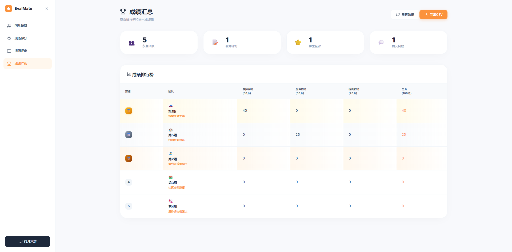
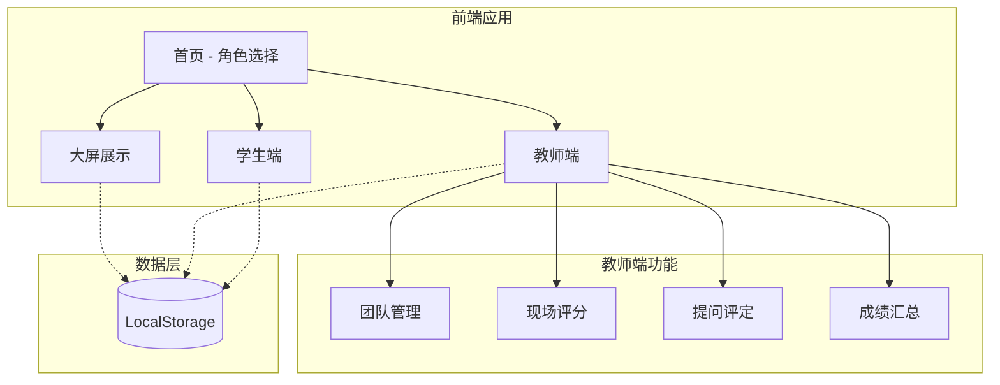

<p align="center">
  
</p>

<h1 align="center">AI-Course EvalMate</h1>

<p align="center">
  <strong>🎓 人工智能课程实训答辩互评系统</strong>
</p>

<p align="center">
  <a href="#特性">特性</a> •
  <a href="#快速开始">快速开始</a> •
  <a href="#评分体系">评分体系</a> •
  <a href="#技术栈">技术栈</a> •
  <a href="#贡献">贡献</a>
</p>

---

## 📖 项目简介

**AI-Course EvalMate** 是一个专为人工智能课程设计的实训答辩互评系统。支持教师评分、学生互评、实时提问统计和大屏展示等功能，采用本地存储方案，无需联网即可使用。



## ✨ 特性

| 功能模块 | 描述 |
|---------|------|
| 🖥️ **大屏展示** | 实时排行榜、倒计时、提问统计，适合投影展示 |
| 👨‍🏫 **教师端** | 团队管理、现场评分、提问评定、成绩汇总 |
| 👩‍🎓 **学生端** | 互评打分、提交问题、进度追踪 |
| 💾 **本地存储** | 基于 localStorage，无需服务器 |
| 📊 **实时统计** | 自动计算排名和成绩 |

## 🖼️ 界面预览

<table>
  <tr>
    <td align="center"><strong>教师端</strong></td>
    <td align="center"><strong>学生端</strong></td>
  </tr>
  <tr>
    <td></td>
    <td></td>
  </tr>
</table>

## 🚀 快速开始

### 环境要求

- Node.js 18+
- npm 或 yarn

### 安装步骤

```bash
# 克隆仓库
git clone https://github.com/24K-GA/AI-Course-EvalMate.git
cd AI-Course-EvalMate

# 安装依赖
npm install

# 启动开发服务器
npm run dev
```

打开 http://localhost:5173 即可访问。

### 🐳 Docker 部署

```bash
# 使用 docker-compose（推荐）
docker-compose up -d

# 或者手动构建运行
docker build -t ai-course-evalmate .
docker run -d -p 3000:80 --name evalmate ai-course-evalmate
```

Docker 部署后访问 http://localhost:3000

## 📊 评分体系

系统采用多维度评分机制，确保评价公正全面：

```
总分 = 教师评分(50%) + 互评均分(30%) + 提问得分(20%)
```

### 评分维度详解

| 评分类型 | 占比 | 满分 | 评分细项 |
|---------|------|------|---------|
| **教师评分** | 50% | 50分 | 内容完整性(10) + 成果质量(20) + 表达展示(10) + 答辩表现(10) |
| **学生互评** | 30% | 30分 | 展示内容(10) + 团队协作(10) + 互动答辩(10) |
| **提问得分** | 20% | 20分 | 相关性(5) + 深度性(10) + 启发性(5) |

> 💡 **互评去极值**：当收到超过3份互评时，自动去除最高分和最低分后取平均

## 🏗️ 系统架构



## 🛠️ 技术栈

| 技术 | 版本 | 用途 |
|-----|------|------|
| React | 19.x | 前端框架 |
| TypeScript | 5.x | 类型安全 |
| Vite | 7.x | 构建工具 |
| React Router | 6.x | 路由管理 |
| Lucide React | - | 图标库 |

## 📁 项目结构

```
AI-Course-EvalMate/
├── src/
│   ├── pages/           # 页面组件
│   │   ├── BigScreen.tsx      # 大屏展示
│   │   ├── TeamManagement.tsx # 团队管理
│   │   ├── TeacherScoring.tsx # 教师评分
│   │   ├── QuestionScoring.tsx# 提问评定
│   │   ├── ScoreSummary.tsx   # 成绩汇总
│   │   └── StudentPage.tsx    # 学生端
│   ├── store/           # 数据存储
│   │   └── storage.ts         # LocalStorage 管理
│   ├── types/           # 类型定义
│   │   └── index.ts
│   ├── utils/           # 工具函数
│   │   ├── scoreCalculator.ts # 成绩计算
│   │   └── dataSeeder.ts      # 模拟数据
│   ├── App.tsx          # 主应用
│   └── main.tsx         # 入口文件
├── docs/                # 文档资源
└── package.json
```

## 🔧 配置说明

### 修改倒计时时长

默认答辩时间为 10 分钟，可在 `BigScreen.tsx` 中修改：

```typescript
const [session, setSession] = useState<SessionStatus>({
  timeLeft: 600, // 修改为所需秒数
  // ...
});
```

### 修改提问要求

默认每组需提问 3 次，可在 `scoreCalculator.ts` 中修改：

```typescript
targetCount: 3, // 修改为所需次数
```

## 🤝 贡献

欢迎提交 Issue 和 Pull Request！

1. Fork 本仓库
2. 创建特性分支 (`git checkout -b feature/AmazingFeature`)
3. 提交更改 (`git commit -m 'Add some AmazingFeature'`)
4. 推送到分支 (`git push origin feature/AmazingFeature`)
5. 开启 Pull Request

## 📄 开源协议

本项目采用 [MIT](LICENSE) 协议开源。

---

<p align="center">
  Made with ❤️ for AI Education
</p>
